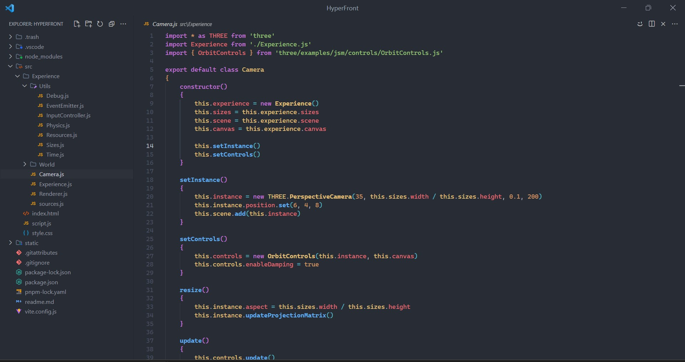
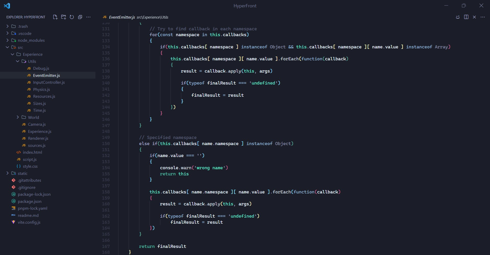

# Vs code settings

My vs code setting for minimal visual clutter

# Preview

# Extensions

[Apc Customize UI++](https://marketplace.visualstudio.com/items?itemName=drcika.apc-extension)

[Symbols](https://marketplace.visualstudio.com/items?itemName=miguelsolorio.symbols)

[One dark Pro](https://marketplace.visualstudio.com/items?itemName=zhuangtongfa.Material-theme)

[Noir Theme Set](https://marketplace.visualstudio.com/items?itemName=andrewberty.noir-theme-bundle)
